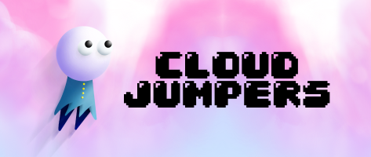

# CloudJumpers

### Overview

Cloud Jumpers is a competitive 1-4 player iOS platformer game. There are power-ups, different game modes, kill mechanics, and more!

Race against the clock in single-player mode, and compete against the rest of the world on the high scores. 
Alternatively, create a lobby with up to three others and compete for the top ranking in two unique multiplayer modes.

Every round you play is randomly generated and different from previous encounters. 
However, if you wish to relive a particular experience, you can always specify a level seed.

We can't wait to race against you on Cloud Jumpers!

### Demo Video:

Click [here](https://www.youtube.com/watch?v=gXo2XJlhLiM) to watch how fun our game is.

### Local setup:
- Install CocoaPods (https://guides.cocoapods.org/using/getting-started.html)
- From repository root, run `pod install`
  - This is to be run everytime you switch branches
- Work on the project using `File > Open > CloudJumpers.xcworkspace`
